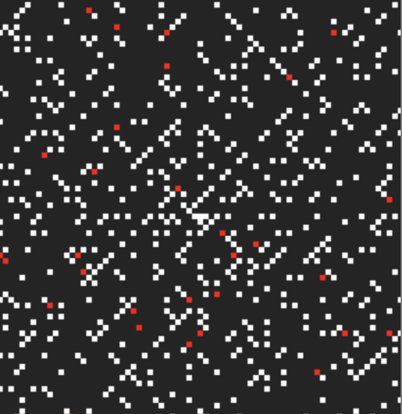
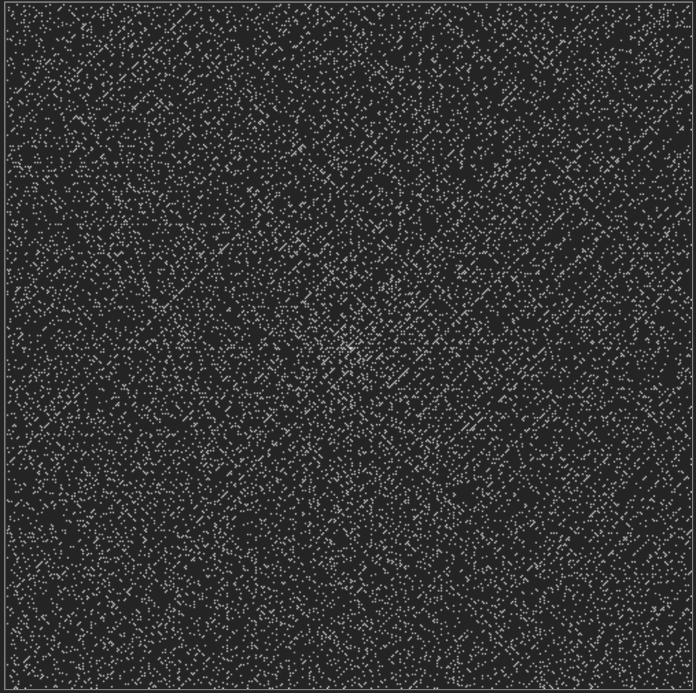

# Prime Spiral

A prime spiral generation tool using Miller Rabin as a means of demonstrating the power of probabilistic algorithms.

Bad results are highlighted in red:

And you can generate as large a spiral as you'd like.

